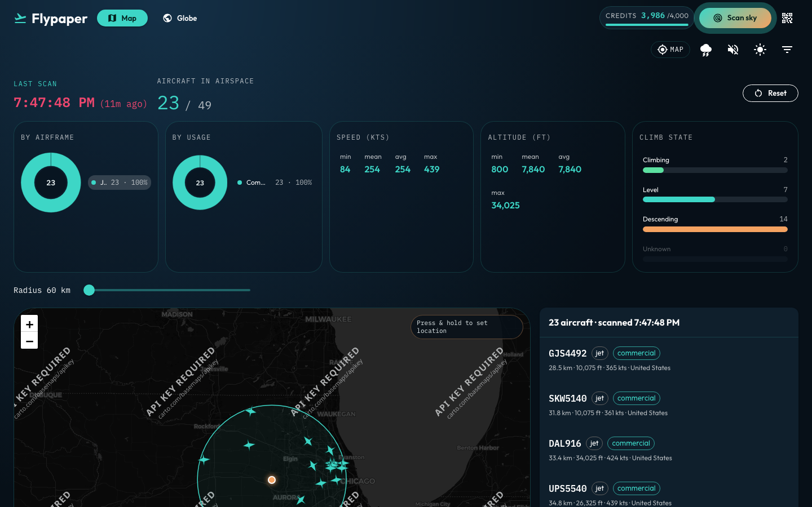

# Filters

Client-side filters on the last snapshot. They never spend OpenSky credits.

## Overview

Open the filter drawer (funnel icon) to refine:

- Usage and airframe
- Climb state
- Altitude range, minimum speed, max distance
- Airborne-only
- Callsign / registration / ICAO text search
- Origin country

The scan stats pies and climb bars toggle the same filter lists. A new scan sets distance max to the current radius.

## Screenshot

Optional `make aircraft-db` enriches typecode / operator / registration for better classification; without it, ADS-B category and callsign heuristics still drive filters.
