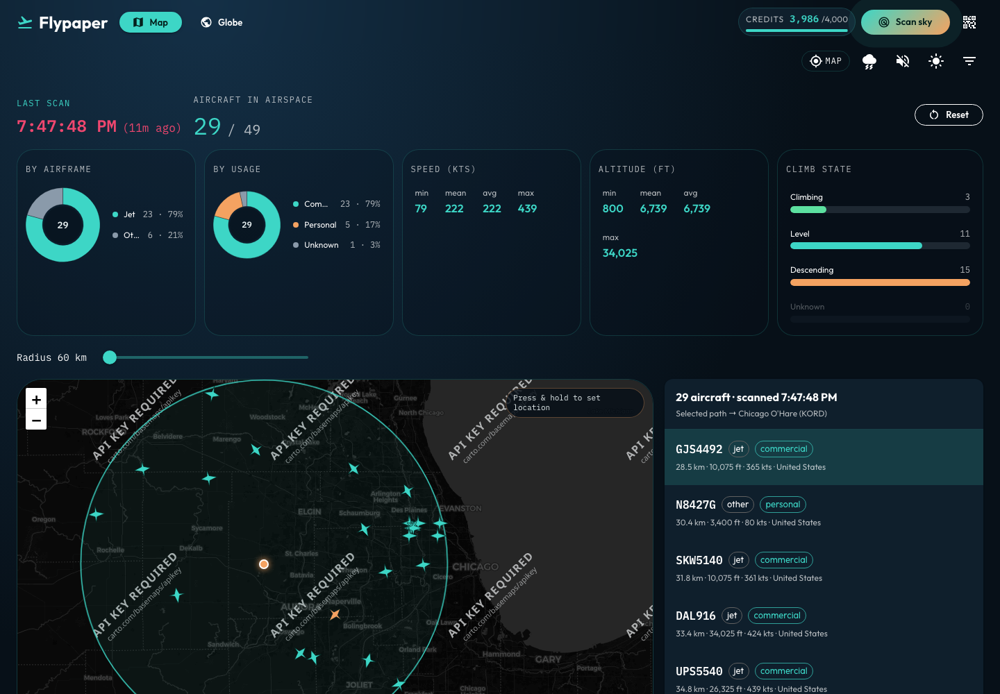

# Flight paths

Selecting an aircraft fetches its OpenSky live track and draws flown + estimated remaining path.

## Overview

- **Flown** path from OpenSky track points (~4 **track** credits — separate from state/scan credits).
- **Remaining** path is estimated toward a guessed hub or along current heading (OpenSky does not expose live IFR destinations).
- Paths render on the Leaflet map and the WebGL globe; results cache in `pathCache` until the next scan.
- Rescanning keeps the selected aircraft when it is still in the new snapshot.

## Screenshot

