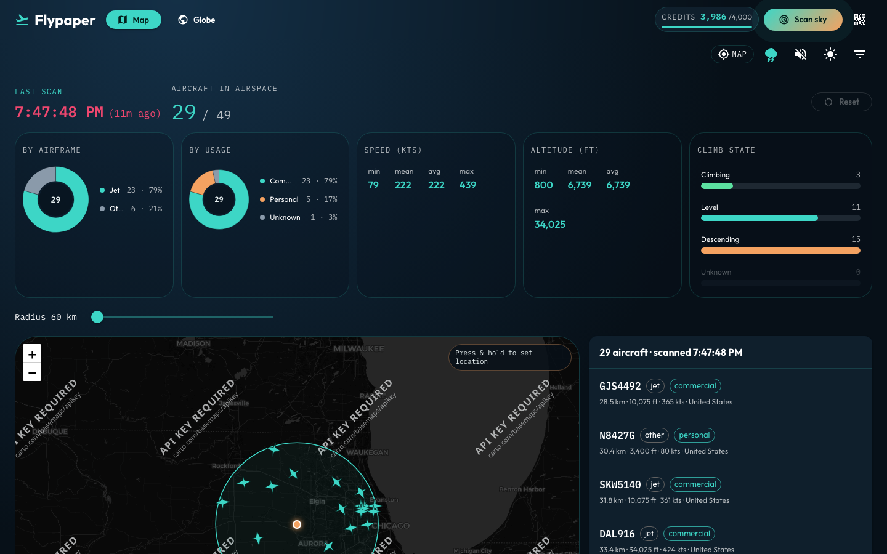

# RainViewer radar

Toggle live precipitation on the map and as a translucent shell on the globe.

## Overview

- Storm icon in the page toolbar enables/disables radar.
- Map uses RainViewer tile frames; globe uses a radar texture shell.
- Metadata (and optional tiles) go through `/api/weather/*` so Safari CORS stays happy.
- Free for personal / educational use — **always attribute RainViewer** (shown in the UI).

## Screenshot

