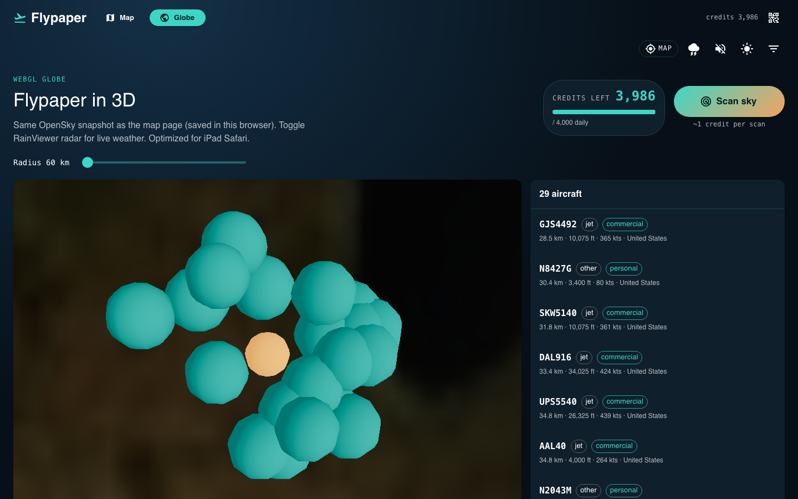
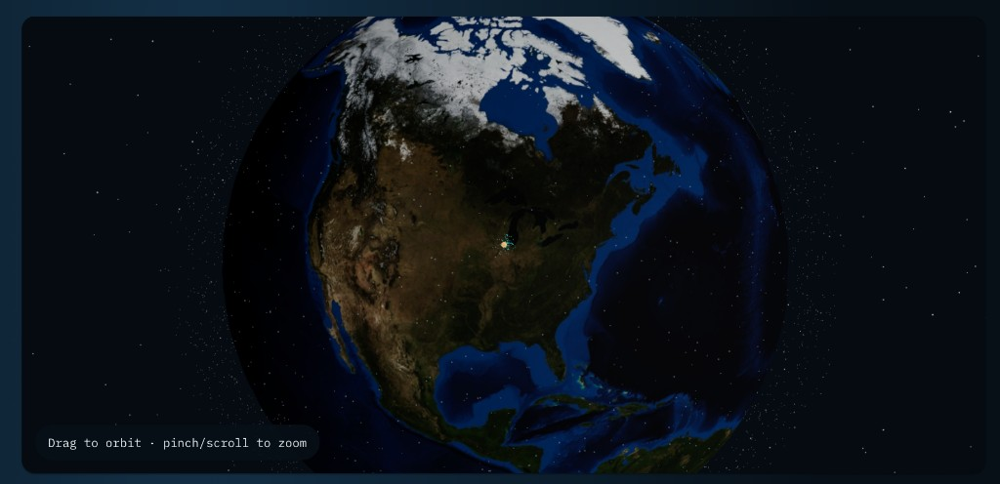

# WebGL globe

Phase 2 view at `/globe` — React Three Fiber globe of the same OpenSky snapshot.

## Overview

- Earth with clouds, stars, observer marker, and aircraft.
- Same scan, filters, radar toggle, and plane list as the Map page.
- Selecting a plane focuses that aircraft (others hide on the globe until you deselect).
- Tuned for iPad Safari: capped DPR, no antialias, fewer particles.

## Screenshots

Orbit with drag; pinch or scroll to zoom down toward ZIP / metro scale over the observer.
